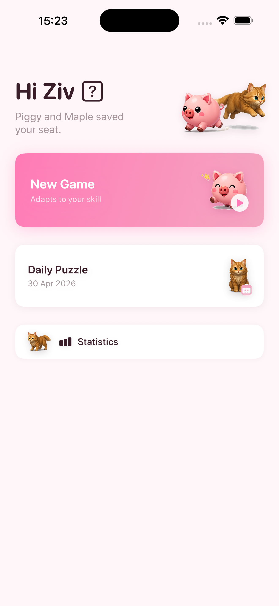
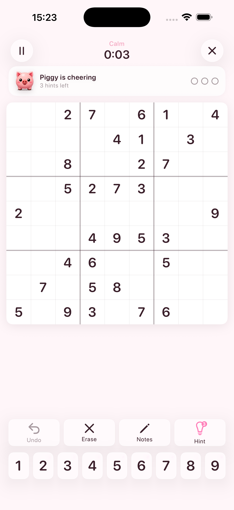
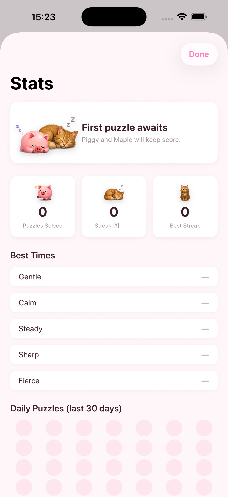

# Zivoku

A Sudoku app I built for my girlfriend's birthday. Clean design, adaptive difficulty, no ads, no tracking.

Built with SwiftUI for iOS 17+.

---

  

---

## Features

- **Adaptive difficulty** — the puzzle generator adjusts to your solving style over time
- **Three difficulty levels** — Easy, Medium, Hard
- **Mistake highlighting** — optional visual feedback
- **Statistics** — tracks your games, streaks, and best times
- **No account, no internet, no ads** — all data stays on your device

## Tech

- SwiftUI + SwiftData
- Custom Sudoku generator and human-strategy solver
- Companion sprite animations for a bit of personality

## Building

Requires Xcode 16+ and iOS 17+ simulator or device.

```bash
open SudokuForZiv.xcodeproj
```

Then build and run the `SudokuForZiv` scheme.

> The project uses [XcodeGen](https://github.com/yonaskolb/XcodeGen) (`project.yml`) if you want to regenerate the `.xcodeproj`.

## License

MIT
